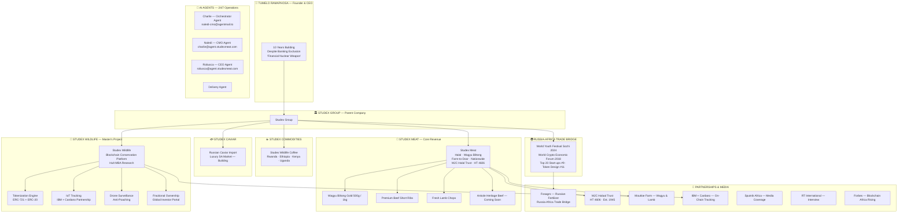

# Studex OS — Master Plan v2
## Updated: 2026-06-30

---

## 🔑 Key Identity Clarifications

### The Ankole Story — The Heart of Studex
- **ANKOLE** — "the most valuable cow", "cow of kings", majestic horns, enormous full body stature
- The Studex logo IS the Ankole cattle
- Ankole = apex African heritage animal, wealth stored in horns and stature
- **Stud** = high-priced Ankole breeding animal (stud bull)
- **Ex** = Exchange — international global trade of African heritage and wealth stored in the Ankole
- Every product connects back to this: premium beef from Ankole-influenced genetics

### Studex Wildlife — Master's Research at Hult
- Hult International Business School — Master's Data Science research project
- Problem: Rare African endangered species being wiped out by hunters, poachers, predators, disease
- Solution: Blockchain/crypto crowdfunding platform with fractionalization
  - Each animal's value divided into shareable fractions
  - Global investors buy fractions — own a piece of a rare African animal
  - IoT tracking devices + drone surveillance = proof of investment + protection
  - Partnership: IBM + Cardano (blockchain on-chain tracking)
  - Tokenized as ERC-721 (whole ownership NFT) or ERC-20 (fractional)
- 2018 World Crypto Economic Forum: Top 20 Start-ups **#9**, Token Design **#11 Overall**
- Video: https://youtu.be/z2My-ELpI4c
- Media: Forbes "Blockchain Africa Rising" — Tumelo interviewed

### Political Challenges (IMPORTANT — don't name father)
- SA banks refused to bank him — called him a "financial nuclear weapon"
- "Politically exposed person" — can't open business accounts in SA
- He pivoted to crypto/decentralized finance as the only way forward
- Tumelo perseverance story: despite being locked out of traditional finance, built Studex to 10 years old
- "With AI anything is fathomable" — his motto

### Bloomberg Buffalo — Proof of Value
- Buffalo valued at record R11.1 million ($11M) — cited by Bloomberg 2016
- This is the Ankole-level valuation model for African heritage animals
- Proof that African wildlife = billions in stored wealth

### Smart Farm — AI/IoT Matrix
- Artificial intelligence matrix of interconnected IoT devices
- LoRa network — long-range, low-power sensors across farm
- Cloud-connected — real-time animal health, location, activity
- Studex Smart Farm = protection + breeding optimization

---

## 🏗️ Studex Group — System Architecture

---

## 📋 Full Tumelo Bio (v3 — No Presidential Reference)

**Tumelo Ramaphosa** — Entrepreneur, 10 years building Africa's premium commodity companies. Called a "financial nuclear weapon" by South African banks who refused to bank him — locked out of the formal financial system because of his political profile. He pivoted to crypto and blockchain as his infrastructure, building Studex as a global agricultural group anyway.

His family's farm is ranked among the **top 20 stud game breeding operations in South Africa** — breeding Ankole cattle, the most valuable cows in Africa, "cow of kings" with majestic horns and enormous stature. This is where Studex begins: the Ankole represents stored African wealth and heritage.

**Stud** = a premium Ankole breeding animal. **Ex** = exchange — global trade of African heritage. The name says it all.

As a master's student at **Hult International Business School**, Tumelo built his thesis project into **Studex Wildlife** — a blockchain platform that tokenizes African wildlife. Fractional ownership lets global investors fund the protection of rare species. IoT sensors and drones monitor every animal on-chain. Partnerships with IBM and Cardano make it real.

The 2018 **World Crypto Economic Forum** ranked Studex **#9 of the Top 20 Start-ups** and **#11 Overall in Token Design**. Forbes featured him in "Blockchain Africa Rising." He attended the 2024 **World Youth Festival in Sochi** as a "trailblazer for his nation's farmers."

At Sochi, he announced Studex as the **official African partner for Fosagro**, Russia's largest fertilizer company — building the Russia-Africa agricultural trade bridge. His uncles sought exile in Russia during the liberation struggle. Trade, he says, is what changes the world.

Today, **Studex Meat** sells premium halal Wagyu biltong, beef, and lamb nationwide. **Studex Wildlife** is developing blockchain conservation. **Studex Caviar** is being built for the luxury Russian import market.

Despite every barrier the old system put in his way, 10 years in — he's still building.

*"With AI anything is fathomable."*

---

## 🛠️ Skills Installed — What They Do for Studex

| Skill | What It Is | What It Does for Studex |
|---|---|---|
| `taste-skill` | Design system collection (14 sub-skills) | Premium, non-generic visual design for all platforms |
| `distinctive-frontend` | Anti-AI-slop frontend skill | World-class websites that don't look "AI generated" |
| `claude-goal` | Persistent task agent (/goal) | Keep researching complex topics without stopping |
| `seo-geo` | AI + traditional SEO optimization | Get Studex found on Google AND ChatGPT/Perplexity |
| `requesthunt` | Reddit/YouTube/Amazon demand research | Discover what customers actually want from biltong |
| `nanobanana` | AI image generation (Gemini) | Product photos, ad creatives, lifestyle imagery |
| `logo-creator` | AI logo generator | New logo variations, seasonal campaigns |
| `banner-creator` | AI banner/header creator | Social media headers, LinkedIn banners |
| `reddit` | Reddit scraping | Monitor SA food community sentiment |
| `planning` | Project planning framework | Structured planning before any build |
| `notebooklm-skill` | Notion/notebook AI | Knowledge graph for Studex OS |

---

## 🔧 Next Actions — Priority Order

### 1. Update Proposal Website (IMMEDIATE)
- Remove "son of president" — use perseverance narrative instead
- Add Ankole story: "Stud = premium breeding animal, Ex = global exchange"
- Add logo inspiration story (Ankole cattle)
- Add "financial nuclear weapon" bank exclusion story
- Add Studex Wildlife blockchain/conservation angle
- Add Smart Farm AI/IoT matrix
- Add 2018 World Crypto Economic Forum ranking
- Fix halal cert: use original full certificate image

### 2. Deploy Updated Proposal
- New link with full corrected Tumelo story

### 3. Clone & Activate MCP Servers
- Set up Claude Code MCP: `code.claude.com/docs/en/mcp`
- Connect additional AI agents to the OS
- All agents report to Obsidian knowledge graph

### 4. Obsidian Knowledge Graph Setup
- Each agent (Charlie, Naledi, Robusca, Delivery) has a memory file
- All sessions logged to daily notes
- MEMORY.md = long-term curated memory
- Cross-agent context sharing via shared vault

### 5. AI Agent Team Setup
- AgentMail inboxes: charlie@, naledi@, ceo@
- Each agent has defined role + skills
- Morning/evening standups via cron nudges
- All reporting to Obsidian vault

### 6. Marketing — Priority Stack
- **seo-geo**: Audit studexmeat.com, get FAQ schema live
- **nanobanana**: Generate all ad creatives for Meta/Facebook
- **requesthunt**: Research what SA consumers want from biltong
- **distinctive-frontend**: Rebuild studexmeat.com with premium design

---

## 📊 Current Status

### Live
- ✅ Proposal v6: https://zk8mcvpunggz.space.minimax.io (needs update with corrected story)
- ✅ Naledi agent: naledi-cmo@agentmail.to — active, Gulf outreach running
- ✅ Charlie agent: charlie@agent.studexmeat.com (DNS pending)
- ✅ Robusca (this agent): CEO overlay

### Blocked
- ⏳ Shopify API token
- ⏳ Meta permanent access token
- ⏳ send.studexmeat.com DNS (AgentMail inboxes)
- ⏳ Netlify auth (site publishing)

### Needs Tumelo
1. Shopify Admin API token
2. Meta permanent access token
3. Netlify auth token
4. Halal cert decision (A or B — use as-is or mask farm name)
5. Any additional photos/documents for the proposal
